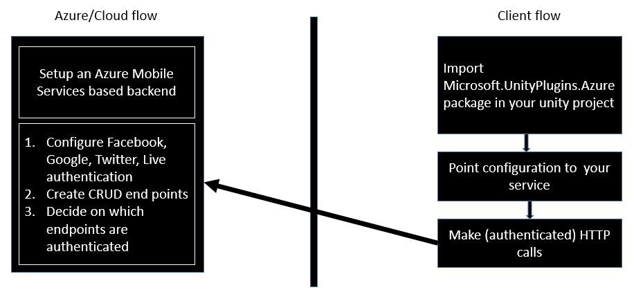

##Introduction
The Azure plugin wraps functionality from [Azure Mobile Services](https://azure.microsoft.com/en-us/documentation/services/mobile-services/) in an easy to use package. If you are not familiar with Azure Mobile Services, do check it [out](https://azure.microsoft.com/en-us/documentation/services/mobile-services/). Azure Mobile Services (also abbreviated as ZuMo) is a way to build cloud services with Azure using very low overhead. ZuMo offers development in JavaScript or C# and offers SDKs for Windows/Windows Phone, iOS and Android, although this Unity Plugin at the moment only supports Windows and Windows Phone. 

ZuMo plugin at this point of time, supports Facebook Login and all the HTTP Verb/CRUD(Create, Update, Read and Delete) operations. The sample contained in the plugin works against the [ToDo Items ZuMo server sample](https://azure.microsoft.com/en-us/documentation/articles/mobile-services-dotnet-backend-windows-store-dotnet-get-started/).


##Concepts
Unlike other plugins which simply need to be imported into the project with no dependencies, to make use of the Azure plugin, you need to setup an Azure Mobile Service with  your custom end points to be able to make use of this plugin. Having this plugin makes your life easier since you don't have to wrap things by hand. To be clearer, here are the steps you need to perform before things will work.



The flow on API calls in ZuMo plugin goes like the following:


The connect call, simply initializes the ZuMo SDK with the credentials supplied. After that, if your HTTP ZuMO APIs require authentication, you should have the user authenticate using the Azure Plugin APIs. Once the connect and authenticate have succeeded, you can invoke the rest of the APIs.

##Before you use the plugin
Before you can use the Azure plugin, you will need to setup a ZuMo service. You can use [this tutorial](https://azure.microsoft.com/en-us/documentation/articles/mobile-services-dotnet-backend-windows-store-dotnet-get-started/) to learn how to do this. The Azure plugin is actually unusable without a deployed ZuMo service.

>Before you can use any of the plugins, you will have to register the Unity AppCallbacks with the plugin. This is required so that Windows APIs that require the Windows UI thread can run on it and then call any callbacks back on the Unity thread.
>
>You should place the following line just after *Window.Current.Activate()* in *InitializeUnity* function in App.xaml.cs

```C#
Microsoft.UnityPlugins.Utils.Initialize((action) => AppCallbacks.Instance.InvokeOnAppThread(new AppCallbackItem(() => action()), false));
```

##How to use the APIs

We wrote the plugins with a consistent API surface in mind to ease development. Any of our APIs that can indicate success or failure use a callback mechanism. The callbacks are passed the result of the API call and we always return the result by wrapping it one of the two container classes [*CallbackResponse* or *CallbackResponse<T>*](https://github.com/Microsoft/unityplugins/blob/master/EditorProjects/Microsoft.UnityPlugins.Common/CallbackResponse.cs). There are a small number of exceptions where APIs directly return a result instead of using a callback, but majority of the APIs follow this model. Here is how the callback data structure looks like in case you don't want to click the link above.

```C#
public enum CallbackStatus
{
    Unknown = -1,
    Failure = 0,
    Success = 1,
    TimedOut = 2
}

public class CallbackResponse
{
    public CallbackStatus Status { get; set; }
    public Exception Exception { get; set; }
}

public class CallbackResponse<T> : CallbackResponse
{
    public T Result { get; set; }
}
```

So, if your callback gets invoked, you should make sure to use a pattern similar to check your results:

```C#
SomePluginComponent.SomeAPICall((response) =>
{

    if (response.Status == CallbackStatus.Failure)
    {
        // An error has occured, take appropriate action
		// details of the error are available in the response.Exception
        return;
    }
	
    // If we reach here, the response.Status is success.
	// If the callback takes a CallbackResponse<T>, then 
	// the result will be contained in response.Result.
	// However, if the callback takes a CallbackResponse, 
	// the API does not return any results and trying to 
	// dereference response.Result will hit a NullReferenceException.
});
```

In the above snippet, we provide an overview of how to handle the results coming back from the a generic plugin API call.


##Samples
A sample is included in the [github repository](https://github.com/Microsoft/unityplugins) under *Samples/AzureMobileServices* folder. A Windows Store exported project with the appropriate settings is present in the *Samples/AzureMobileServices/out_win10* folder.

##API Reference

###Enumerations
```C#
public enum MobileServiceAuthenticationProvider
{
    Facebook = 0,
    Google = 1,
    MicrosoftAccount = 2,
    Twitter = 3,
    WindowsAzureDirectory = 4
}
```	
###Proxy/stub classes

```C#
public class MobileServiceUser
{
    public string MobileServiceAuthenticationToken { get; set; }
    public string UserId { get; set; }
}
```
	
###AzureMobileServices classes


*Connect* is the first API call from Azure plugin that needs to be invoked before invoking anything else. Without this, the other calls will fail
	
```C#
    public static void Connect(string applicationUri, string applicationKey);
```


ZuMo HTTP endpoints can be set to require authentication or not require authentication. Most games and applications require user authentication to create a customized profile. ZuMo has built in authentication for Facebook, Twitter, Google and Live. You will have to configure some information on the ZuMo portal to use these authentication mechanisms and then finally make this API call from the client to authenticate the user.

```C#

    public static void AuthenticateWithServiceProvider(MobileServiceAuthenticationProvider authenticationProvider, 
        Action<MobileServiceUser> OnAuthenticationFinished);
```		


*Insert/Lookup/Update/Delete/Where<T>* are generic functions that take a generic object as input. You can specify any C# object to these APIs in the ZuMo service. Usually, a table of the same name as the type needs to be present on the ZuMo side. When the HTTP call is finished, supplied event handler is invoked.

```C#
    public static void Insert<T>(T item, Action OnInsertFinished);
    public static void Lookup<T>(string id, Action<T> OnLookupFinished);
    public static void Update<T>(T item, Action OnUpdateFinished);
    public static void Delete<T>(T item, Action OnDeleteFinished);
    public static void Where<T>(Expression<Func<T, bool>> predicate, Action<List<T>> OnWhereFinished);
```

> Note that although we take great effort towards making sure that the API reference is up to date, the [github repository](https://github.com/Microsoft/unityplugins) is the final authority. In particular, the [AzureMobileServices.cs File](https://github.com/Microsoft/unityplugins/blob/master/EditorProjects/Microsoft.UnityPlugins.AzureMobileServices.Editor/AzureMobileServices.cs) in the official repository is the final authoritative source in case documentation and plugin don't seem to be agreeing.

